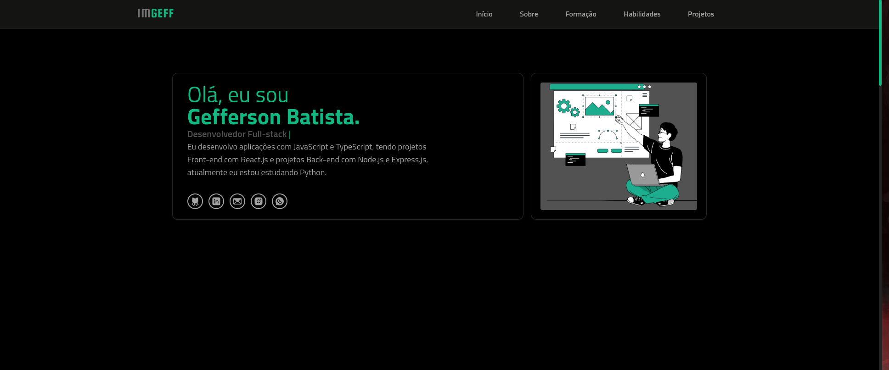
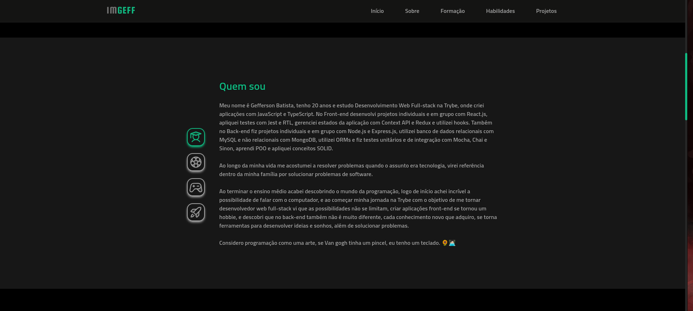
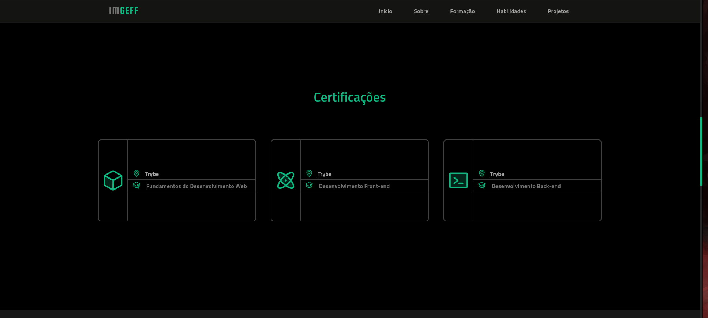
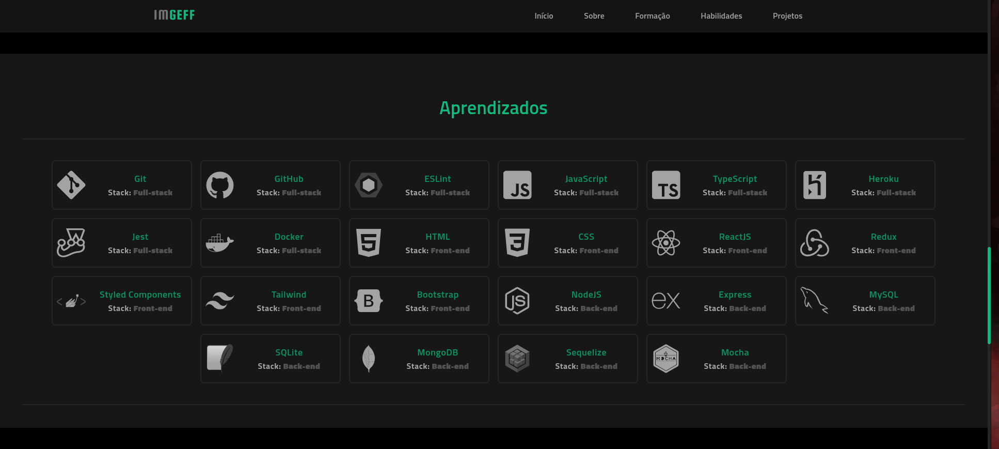
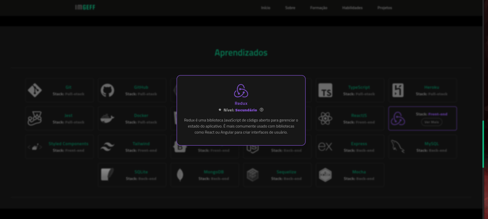
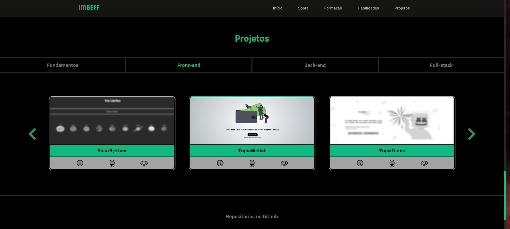
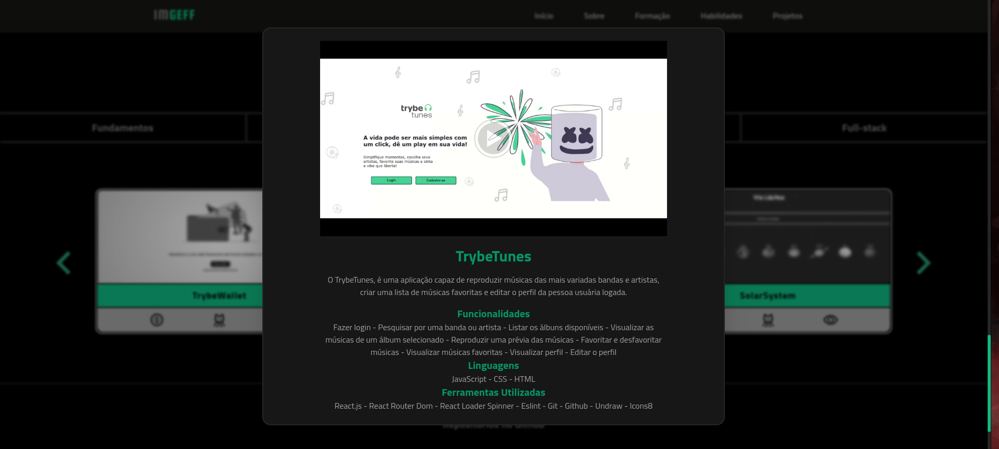

# Portfólio | Gefferson Batista

 

  
<strong>📷 Mais imagens do Portfólio</strong>
 
  
  
  
  
  
  

 

# Sobre o Projeto

Este  projeto é o meu portfólio, onde eu me apresento como desenvolvedor demonstrando aprendizados, certificações e projetos já feitos até o momento, além de tudo isso ainda conto um pouquinho mais sobre mim.

## Ferramentas utilizadas

> Linguagens: `HTML/CSS`, `Javascript/Typescript`

> Frameworks: `Tailwind CSS`

> Bibliotecas: `React`, `Phosphor React`, `Splidejs`

> Plugins: `Daisyui`

> Linters: `Eslint`

### [Link da Aplicação](https://batist-geff.vercel.app/)
